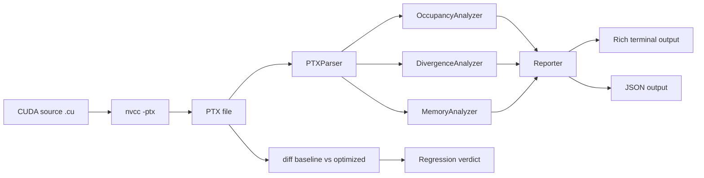
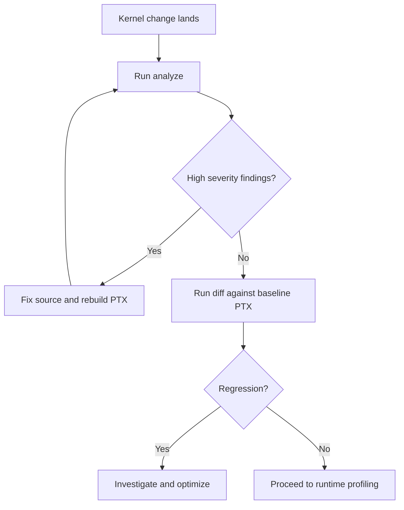
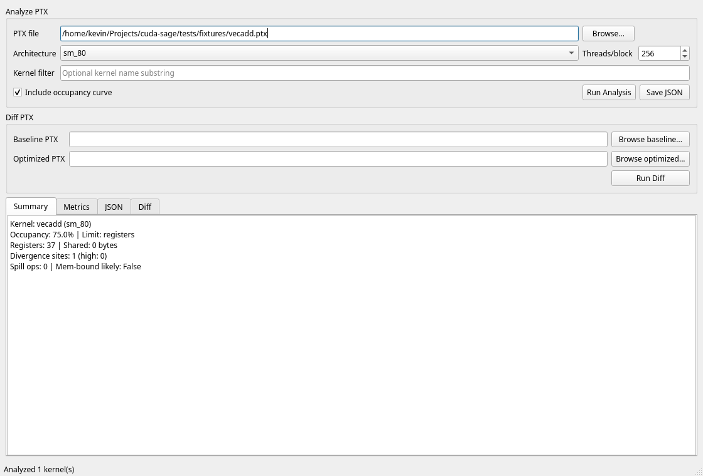
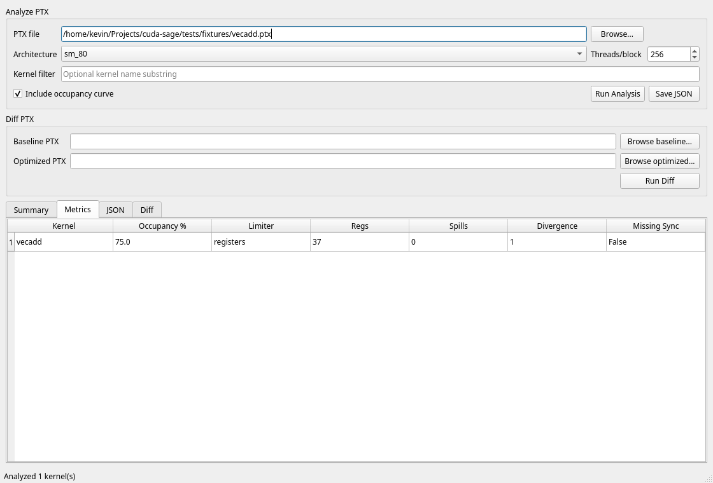
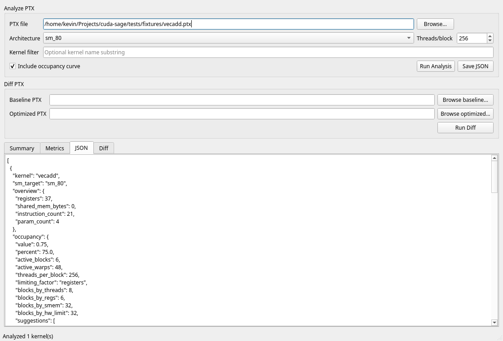
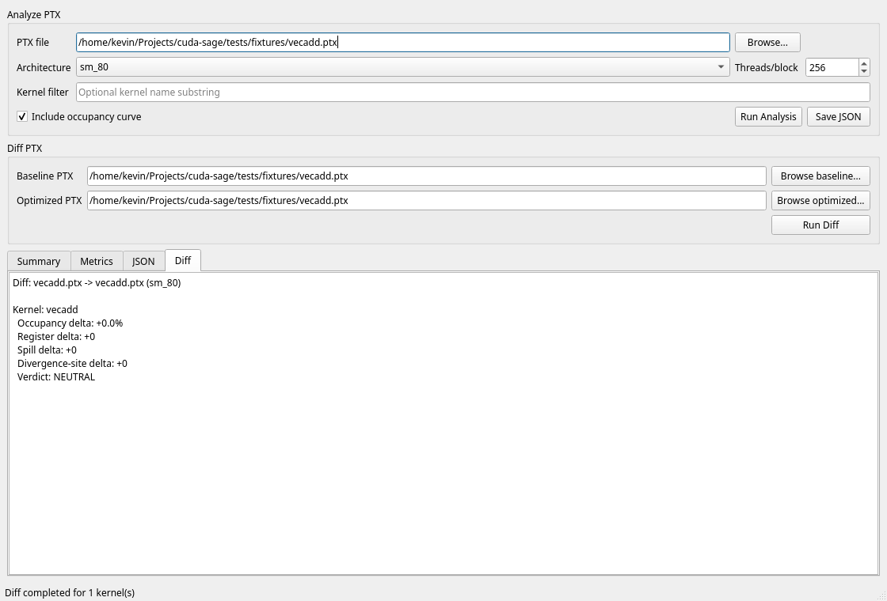

# cuda-sage

[](https://www.python.org/)
[](LICENSE)
[](docs/analysis-guide.md)
[](src/cudasage/cli.py)

Fast static PTX analysis for CUDA teams that want actionable performance feedback before runtime profiling.

cuda-sage is intentionally focused. It parses PTX text, estimates occupancy, flags likely warp divergence sites, identifies memory-risk patterns, and compares PTX revisions for regression direction. The tool is designed to run in local development, code review, and CI environments where speed and repeatability matter.

> [!IMPORTANT]
> cuda-sage is a static analysis tool. It should guide optimization choices early, but it does not replace runtime validation with Nsight tools on target hardware.

---

## Table Of Contents

- [What It Is, What It Does, And Why It Is Needed](#what-it-is-what-it-does-and-why-it-is-needed)
- [Why This Project Exists](#why-this-project-exists)
- [What You Get](#what-you-get)
- [Architecture At A Glance](#architecture-at-a-glance)
- [Quick Start](#quick-start)
- [Desktop GUI (PyQt6)](#desktop-gui-pyqt6)
- [CLI Reference](#cli-reference)
- [JSON Output For Automation](#json-output-for-automation)
- [How To Read Results](#how-to-read-results)
- [Architecture Support](#architecture-support)
- [Python API Usage](#python-api-usage)
- [Project Structure](#project-structure)
- [Development Workflow](#development-workflow)
- [CI Integration Example](#ci-integration-example)
- [Troubleshooting](#troubleshooting)
- [Limitations](#limitations)
- [Documentation](#documentation)
- [License](#license)

---

## What It Is, What It Does, And Why It Is Needed

cuda-sage is a static performance-analysis assistant for CUDA teams. It is not a profiler, compiler replacement, or runtime benchmarking framework. Instead, it operates one step earlier in the workflow and turns PTX into fast optimization guidance that can be reviewed during development and in pull requests.

It does three things very consistently: it parses PTX kernel metadata, computes architecture-aware occupancy estimates, and highlights control-flow and memory risks that commonly lead to performance loss. Because this process is static, the same analysis can run locally and in CI without requiring access to a GPU node.

This matters most when teams need rapid iteration loops. Performance regressions are often discovered late, after integration and benchmark setup. cuda-sage closes that gap by giving reviewers and kernel authors a common signal set before runtime tuning starts, which reduces churn and makes optimization discussions concrete.

> [!IMPORTANT]
> cuda-sage is designed to reduce late surprises, not replace final runtime validation. Use it to prioritize work early, then confirm impact with Nsight tools on target hardware.

---

## Why This Project Exists

Many CUDA performance issues are discovered too late. In common workflows, developers only see occupancy bottlenecks, divergence-heavy branches, or spill pressure after kernels are already integrated and benchmarked on specific machines. That creates long feedback loops and makes it harder to isolate regressions in pull requests.

cuda-sage shifts that feedback to an earlier stage by analyzing PTX directly. Because the analysis is static, teams can evaluate likely performance risks on any machine, including CI runners that have no attached GPU. This enables a more consistent review process and helps catch expensive mistakes before runtime optimization begins.

Static PTX analysis is also useful for collaboration. Kernel authors, reviewers, and platform engineers can discuss concrete signals, such as register pressure, divergence predicates, and memory warnings, from a shared report format rather than relying only on local benchmark anecdotes.

> [!NOTE]
> PTX is an intermediate representation and not final machine code. Results are best used as early guidance and should be paired with targeted runtime profiling for production sign-off.

---

## What You Get

| Capability | What It Detects | Why It Matters | Typical Follow-Up |
| --- | --- | --- | --- |
| PTX parser | Kernel boundaries, register declarations, instruction categories, shared memory usage | Builds a consistent analysis model without executing kernels | Use parsed metadata for analysis and CI reports |
| Occupancy analyzer | Thread, register, shared-memory, and hardware block limits | Low occupancy can reduce latency hiding and throughput | Reduce register pressure, adjust launch size, trim shared memory |
| Divergence analyzer | Thread-varying branch predicates and high-risk split patterns | Divergent branches serialize warp execution | Refactor branch conditions, prefer predication where practical |
| Memory analyzer | Spill activity, bank-conflict risk hints, missing sync patterns, intensity proxy | Memory pressure often dominates end-to-end performance | Rework data layout, reduce spills, add synchronization where needed |
| PTX diff mode | Delta in occupancy, registers, spills, and divergence sites | Detect directional regressions earlier in review | Gate merges or trigger optimization follow-up |

### Focus Principles

- Keep the scope narrow enough to remain reliable and maintainable.
- Prefer fast feedback over expensive infrastructure requirements.
- Produce outputs that are useful to humans and machines.

> [!TIP]
> Teams usually get the most value when they run `analyze` and `diff` on every PR that changes kernel code or build output.

---

## Architecture At A Glance





---

## Quick Start

### 1. Install

```bash
git clone https://github.com/hkevin01/cuda-sage
cd cuda-sage
python -m venv .venv
source .venv/bin/activate
pip install -e .
```

### 2. Generate PTX

```bash
nvcc -ptx -arch=sm_86 mykernel.cu -o mykernel.ptx
```

### 3. Analyze

```bash
cuda-sage analyze mykernel.ptx --arch sm_86 --threads 256 --curve
```

This command runs occupancy, divergence, and memory analysis on each kernel entry in the PTX file. The report includes metrics, limiting factors, and recommendations that can be reviewed in local shells or attached to CI artifacts.

> [!TIP]
> If your team targets multiple GPU generations, run separate reports per architecture to avoid false confidence from a single target assumption.

---

## Desktop GUI (PyQt6)

If you prefer a native desktop app over command-line usage, cuda-sage now includes a PyQt6 GUI.

The GUI is intentionally built on the same parser and analyzer pipeline as the CLI, so it is a different interface, not a different engine. You get equivalent results with a workflow that is easier for visual review, demonstrations, and onboarding engineers who prefer desktop tools.

### Why A GUI Is Useful

- It lowers the friction for teams that do not want to memorize CLI flags.
- It makes report interpretation faster with side-by-side tabs for summary, metrics, JSON, and diffs.
- It helps cross-functional reviews where not every participant is comfortable with terminal tooling.
- It preserves reproducibility by exporting the same machine-consumable JSON schema used in automation.

### Install GUI Dependencies

```bash
pip install -e ".[gui]"
```

### Launch The Desktop App

```bash
cuda-sage-gui
```

### What The GUI Supports

| Section | Capability |
| --- | --- |
| Analyze tab | Pick a PTX file, choose architecture and threads/block, optional kernel filter, optional occupancy curve |
| Metrics tab | Per-kernel occupancy, bottleneck, register count, spill count, divergence count, sync-risk flag |
| JSON tab | Full JSON report preview matching CLI schema |
| Diff tab | Baseline vs optimized PTX comparison with per-kernel deltas and verdict |
| Export | Save current analysis JSON report directly from the desktop app |

> [!NOTE]
> The desktop app uses the same parser and analyzer pipeline as CLI mode, so results remain consistent across interfaces.

### GUI Screenshots

#### Summary View

The summary tab gives a compact per-kernel readout of occupancy, limiting factors, divergence signals, and memory pressure hints so reviewers can triage quickly.



#### Metrics Table

The metrics tab turns core findings into sortable columns for quick comparison across kernels, which is useful when choosing where to optimize first.



#### JSON Preview

The JSON tab exposes the exact report structure that CI policies can consume, reducing the chance of mismatch between desktop review and automation behavior.



#### Diff View

The diff tab compares baseline and candidate PTX files with directional deltas and a verdict, which helps make regression risk visible before runtime benchmarking.



---

## CLI Reference

| Command | Purpose | Common Options | Example |
| --- | --- | --- | --- |
| `analyze` | Analyze kernels in a PTX file | `--arch`, `--threads`, `--curve`, `--kernel`, `--format`, `--output` | `cuda-sage analyze kernel.ptx --arch sm_80 --curve` |
| `diff` | Compare baseline vs optimized PTX | `--arch`, `--threads` | `cuda-sage diff base.ptx opt.ptx --arch sm_80` |
| `list-archs` | Print supported architecture table | none | `cuda-sage list-archs` |
| `--version` | Print version and exit | `-V` | `cuda-sage --version` |

### Analyze Examples

```bash
# Text report
cuda-sage analyze kernel.ptx --arch sm_80

# Kernel filter
cuda-sage analyze all_kernels.ptx --kernel matmul --arch sm_90

# JSON output to file
cuda-sage analyze kernel.ptx --arch sm_80 --format json --output report.json
```

### Diff Example

```bash
cuda-sage diff baseline.ptx optimized.ptx --arch sm_80 --threads 256
```

Diff compares kernels by name and reports metric deltas with a simple verdict model. This helps reviewers see whether a change appears to improve, regress, or remain neutral before deeper benchmarking.

---

## JSON Output For Automation

JSON mode allows policy checks and dashboards without parsing terminal output.

```bash
cuda-sage analyze kernel.ptx --arch sm_80 --format json --output report.json
```

Typical machine-consumed fields include:

| JSON Path | Meaning |
| --- | --- |
| `occupancy.value` | Occupancy in range `[0.0, 1.0]` |
| `occupancy.limiting_factor` | Dominant occupancy bottleneck |
| `divergence.site_count` | Number of detected divergence sites |
| `divergence.high_severity_count` | Count of high-risk divergence sites |
| `memory.spill_ops` | Total local load/store spill operations |
| `memory.possible_missing_sync` | Shared write without observed barrier hint |

> [!IMPORTANT]
> JSON values are analysis signals, not hardware measurements. Keep thresholds practical and validate strict failures with runtime profiling.

---

## How To Read Results

### Suggested Triage Order

1. Check occupancy and identify the limiting factor.
2. Inspect divergence findings, especially high-severity sites.
3. Review memory warnings for spills, sync risk, and conflict hints.
4. Compare baseline and candidate PTX with `diff` to quantify direction.

This sequence reduces rework by solving broad resource constraints before fine-grained micro-optimizations.

### Severity Interpretation

| Severity | Interpretation | Typical Priority |
| --- | --- | --- |
| High | Strong signal of likely performance impact | Address before merge for critical kernels |
| Medium | Context-dependent risk worth investigation | Address in current optimization cycle |
| Low | Informational guidance | Track and batch with related work |

### Practical Tips

- Keep baseline PTX snapshots for critical kernels so `diff` remains meaningful.
- Align `--threads` with production launch assumptions when possible.
- Avoid overreacting to single low-severity signals; look for repeated patterns across kernels.
- Re-run analysis after each optimization pass to validate direction.

> [!NOTE]
> Heuristic warnings are intended to be conservative. They are most useful when treated as prioritization hints rather than absolute truth.

---

## Architecture Support

| SM Target | Representative GPU | Max Warps/SM | Max Threads/SM | Regs/SM | Shared Mem/SM |
| --- | --- | ---: | ---: | ---: | ---: |
| `sm_70` | Volta V100 | 64 | 2048 | 65536 | 96 KB |
| `sm_75` | Turing T4 / RTX 2080 | 32 | 1024 | 65536 | 64 KB |
| `sm_80` | Ampere A100 | 64 | 2048 | 65536 | 164 KB |
| `sm_86` | Ampere RTX 3080/3090 | 48 | 1536 | 65536 | 100 KB |
| `sm_89` | Ada RTX 4090 class | 48 | 1536 | 65536 | 100 KB |
| `sm_90` | Hopper H100 | 64 | 2048 | 65536 | 228 KB |

Use `cuda-sage list-archs` for runtime display of supported architecture models.

---

## Python API Usage

Each component is importable and composable.

```python
from cudasage import PTXParser, OccupancyAnalyzer, DivergenceAnalyzer, MemoryAnalyzer
from cudasage import get_arch

kernels = PTXParser().parse_file("kernel.ptx")
arch = get_arch("sm_80")

occ = OccupancyAnalyzer().analyze(kernels[0], arch, threads_per_block=256)
div = DivergenceAnalyzer().analyze(kernels[0])
mem = MemoryAnalyzer().analyze(kernels[0])

print("Occupancy:", occ.occupancy, occ.limiting_factor)
print("Divergence sites:", len(div.sites))
print("Spill ops:", mem.spill_ops)
```

### Occupancy Curve Example

```python
curve = OccupancyAnalyzer().occupancy_curve(kernels[0], arch)
for pt in curve:
    print(pt.threads_per_block, pt.occupancy, pt.limiting_factor)
```

---

## Project Structure

```text
src/cudasage/
├── __init__.py
├── cli.py
├── reporter.py
├── analyzers/
│   ├── occupancy.py
│   ├── divergence.py
│   └── memory.py
├── models/
│   └── architectures.py
└── parsers/
    └── ptx_parser.py

tests/
├── fixtures/
│   ├── vecadd.ptx
│   ├── divergent_kernel.ptx
│   ├── matmul.ptx
│   └── reduction.ptx
├── test_cli.py
├── test_parser.py
├── test_occupancy.py
├── test_divergence.py
├── test_memory.py
├── test_reporter.py
├── test_fixtures.py
└── test_public_api.py
```

The codebase is intentionally compact so contributors can reason about the entire system without crossing multiple product domains.

---

## Development Workflow

```bash
pip install -e ".[dev]"
pytest -v
```

### Suggested PR Checklist

- [ ] Added or updated tests for changed analysis behavior
- [ ] Validated CLI behavior for new options or error paths
- [ ] Reviewed JSON output impact for downstream automation
- [ ] Confirmed architecture assumptions in test fixtures

---

## CI Integration Example

```yaml
name: ptx-static-analysis

on:
  pull_request:
  push:
    branches: [main]

jobs:
  analyze:
    runs-on: ubuntu-latest
    steps:
      - uses: actions/checkout@v4
      - uses: actions/setup-python@v5
        with:
          python-version: "3.11"
      - name: Install
        run: |
          python -m venv .venv
          source .venv/bin/activate
          pip install -e .
      - name: Analyze fixture
        run: |
          source .venv/bin/activate
          cuda-sage analyze tests/fixtures/matmul.ptx --arch sm_80 --format json --output report.json
      - name: Upload report
        uses: actions/upload-artifact@v4
        with:
          name: cuda-sage-report
          path: report.json
```

---

## Troubleshooting

### Command Reports No Kernels Found

> [!NOTE]
> The parser expects PTX `.entry` kernels. Verify your compile step produced a PTX file with visible entry functions.

### Architecture String Looks Ignored

> [!IMPORTANT]
> Unknown architecture values fall back to the nearest supported model. Run `cuda-sage list-archs` to confirm available targets.

### JSON Output File Path Fails In CI

> [!TIP]
> Use `--output` with a writable path in the runner workspace. The CLI creates parent directories when needed, but the target location still must be writable.

### Divergence Warning Seems Too Conservative

> [!NOTE]
> Some patterns are flagged intentionally to reduce false negatives for high-cost branch behavior. Use branch-efficiency runtime metrics to prioritize what to fix first.

---

## Limitations

- PTX-only static analysis. No SASS parsing and no direct runtime timing.
- Divergence and bank-conflict checks are heuristic by design.
- Reports describe likely risk and optimization direction, not guaranteed speedup.

This trade-off is intentional so the tool remains fast, portable, and suitable for early-stage gating.

---

## Documentation

- [API Reference](docs/api-reference.md)
- [Analysis Guide](docs/analysis-guide.md)
- [Architecture Specs](docs/architecture-specs.md)

---

## License

MIT. See [LICENSE](LICENSE).
