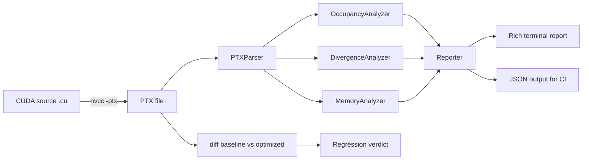
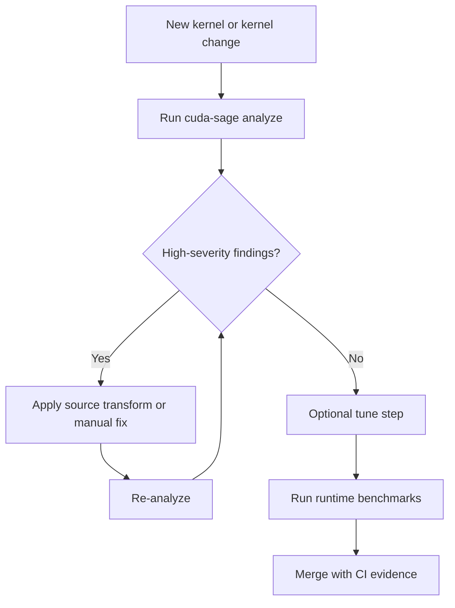

# cuda-sage

[](https://www.python.org/)
[](LICENSE)
[](https://pypi.org/)
[](docs/architecture-specs.md)
[](src/cudasage/cli.py)

Static PTX analysis for CUDA teams that want early, repeatable performance feedback before running on hardware.

cuda-sage helps you detect occupancy bottlenecks, branch divergence risk, memory hazards, and launch-parameter opportunities directly from PTX text. This design keeps the feedback loop short in local development, code review, and CI pipelines, where GPU availability can be limited or inconsistent.

> [!IMPORTANT]
> cuda-sage analyzes PTX statically. It does not replace runtime profiling, but it does move critical performance conversations earlier in the development lifecycle where fixes are cheaper.

---

## Table Of Contents

- [What Problem This Solves](#what-problem-this-solves)
- [What You Get](#what-you-get)
- [Visual System Overview](#visual-system-overview)
- [Quick Start](#quick-start)
- [Command Reference](#command-reference)
- [Architecture Support](#architecture-support)
- [Analyzer Deep Dive](#analyzer-deep-dive)
- [Source Transformer Guide](#source-transformer-guide)
- [Auto-Tuning Guide](#auto-tuning-guide)
- [CI And Automation](#ci-and-automation)
- [Python API Recipes](#python-api-recipes)
- [Interpreting Results](#interpreting-results)
- [Project Structure](#project-structure)
- [Development Workflow](#development-workflow)
- [Limitations](#limitations)
- [Roadmap](#roadmap)
- [FAQ](#faq)
- [License](#license)

---

## What Problem This Solves

CUDA optimization often starts too late. Teams usually discover bottlenecks after kernels are already integrated into larger systems, which means each performance bug comes with expensive triage, repro setup, and hardware scheduling overhead. This can drag out iteration cycles and make regressions hard to catch in pull requests.

cuda-sage changes that timing. By analyzing PTX assembly statically, it gives you deterministic guidance at build and review time, including occupancy constraints, divergence hotspots, spill pressure, and shared-memory risk patterns. That makes performance review more predictable and more collaborative across compiler engineers, kernel developers, and platform owners.

In practice, this means you can establish a shared performance baseline without requiring a GPU in every environment. The same checks can run on laptops, cloud CI, and pre-merge automation, keeping feedback continuous and measurable.

> [!NOTE]
> PTX is still an intermediate representation, so final SASS-level behavior may vary by toolchain and architecture. Use cuda-sage as an early warning and design aid, then validate high-value paths with Nsight or production telemetry.

---

## What You Get

| Capability | What It Detects | Why It Matters | Typical Action |
|---|---|---|---|
| Occupancy analyzer | Register, shared-memory, thread, and hardware block limits | Low occupancy can hide memory latency poorly and reduce throughput | Reduce register pressure, rebalance block size, trim shared memory |
| Divergence analyzer | Taint-propagated branch predicates from thread-dependent values | Warp serialization can cut effective utilization in half on branch-heavy kernels | Restructure branch conditions, predicate work, rebucket data |
| Memory analyzer | Spill ops, bank conflict risk, missing synchronization hints, intensity proxy | Memory behavior dominates end-to-end latency in many kernels | Improve data layout, add barriers, reduce spills, tune tiling |
| PTX diff mode | Delta in occupancy, registers, spills, divergence sites | Enables regression-aware review before runtime benchmarks | Gate merges on directional regressions |
| Source transformer | Safe source-level optimizations for common CUDA patterns | Standardizes low-risk improvements across codebases | Apply generated edits, then benchmark |
| Auto-tuner | Parameter sweep with GPU benchmarking or static fallback model | Finds better launch/config values quickly | Adopt best config and persist in code or build system |

> [!TIP]
> Use static analysis as a policy layer, not just an ad-hoc report. Teams usually see the most value once results are reviewed consistently in pull requests.

---

## Visual System Overview

The project is designed as a modular analysis pipeline where parsing, analysis, and reporting are independent steps. This keeps each component testable and reusable in both CLI and Python workflows.



The decision flow below captures a pragmatic workflow for teams that want fast iteration while preserving confidence in runtime behavior.



---

## Quick Start

### 1. Clone And Install

```bash
git clone https://github.com/hkevin01/cuda-sage
cd cuda-sage
python -m venv .venv
source .venv/bin/activate
pip install -e .
```

cuda-sage requires Python 3.11 or newer. The core analysis path does not require a GPU, which makes it practical in standard CI runners and lightweight local environments.

### 2. Compile CUDA To PTX

```bash
nvcc -ptx -arch=sm_86 mykernel.cu -o mykernel.ptx
```

If you are already producing PTX in your existing build, use that output directly. You do not need to change your compiler integration just to use the analyzer.

### 3. Analyze

```bash
cuda-sage analyze mykernel.ptx --arch sm_86 --threads 256 --curve
```

This command runs occupancy, divergence, and memory passes on each kernel entry in the PTX file, then prints a rich terminal report with severity cues and suggestions.

> [!TIP]
> Start with your production launch size in `--threads`. Then rerun with `--curve` to discover whether a nearby block size would likely improve occupancy stability.

---

## Command Reference

cuda-sage exposes a Typer-based CLI focused on analysis, comparison, transformation, and tuning workflows.

| Command | Purpose | Common Options | Example |
|---|---|---|---|
| `analyze` | Full static analysis of PTX kernels | `--arch`, `--threads`, `--curve`, `--kernel`, `--format`, `--output` | `cuda-sage analyze kernel.ptx --arch sm_80 --format json` |
| `diff` | Compare baseline vs optimized PTX | `--arch`, `--threads` | `cuda-sage diff base.ptx opt.ptx --arch sm_90` |
| `list-archs` | Show supported architecture table | none | `cuda-sage list-archs` |
| `transform` | Apply source-to-source CUDA optimizations | `--output`, `--block-size`, `--diff` | `cuda-sage transform kernel.cu --diff` |
| `tune` | Search launch/config parameters with GPU or model source | `--kernel`, `--arch`, `--block-sizes`, `--strategy`, `--n`, `--no-gpu` | `cuda-sage tune kernel.cu --block-sizes 64,128,256 --no-gpu` |
| `--version` | Print installed version | `-V` | `cuda-sage --version` |

### Analyze Examples

```bash
# Human-readable report
cuda-sage analyze mykernel.ptx --arch sm_80 --threads 256

# JSON for automation
cuda-sage analyze mykernel.ptx --arch sm_80 --format json --output report.json

# Single-kernel filter
cuda-sage analyze all_kernels.ptx --kernel matmul --arch sm_90 --curve
```

### Diff Example

```bash
cuda-sage diff baseline.ptx optimized.ptx --arch sm_80 --threads 256
```

The diff report classifies each matched kernel as `IMPROVED`, `REGRESSION`, or `NEUTRAL` by combining occupancy movement with register, spill, and divergence deltas.

### Transform Example

```bash
cuda-sage transform matmul.cu --block-size 256 --output matmul.optimized.cu
```

### Tune Example

```bash
cuda-sage tune matmul.cu --kernel matmul --arch sm_86 --block-sizes 64,128,256,512 --strategy grid --no-gpu
```

> [!IMPORTANT]
> The tune command can use GPU benchmarking when available. Use `--no-gpu` for deterministic model-only analysis in CI or on non-NVIDIA hosts.

---

## Architecture Support

Supported hardware profiles are currently modeled from sm_70 through sm_90.

| SM Target | Representative GPU | Max Warps/SM | Max Threads/SM | Regs/SM | Shared Mem/SM |
|---|---|---:|---:|---:|---:|
| sm_70 | Volta V100 | 64 | 2048 | 65536 | 96 KB |
| sm_75 | Turing T4 / RTX 2080 | 32 | 1024 | 65536 | 64 KB |
| sm_80 | Ampere A100 | 64 | 2048 | 65536 | 164 KB |
| sm_86 | Ampere RTX 3080/3090 | 48 | 1536 | 65536 | 100 KB |
| sm_89 | Ada RTX 4090 class | 48 | 1536 | 65536 | 100 KB |
| sm_90 | Hopper H100 | 64 | 2048 | 65536 | 228 KB |

These architecture constraints drive occupancy calculations and recommendations. Choosing the correct `--arch` value is critical because feasible block residency and shared-memory pressure can differ substantially across generations.

> [!NOTE]
> When you benchmark on one architecture but deploy on another, run separate analyses for both targets. A kernel that appears stable on one SM class can become occupancy-constrained on another due to different block or memory limits.

---

## Analyzer Deep Dive

### Occupancy Analyzer

The occupancy analyzer computes active warps per SM from four hard limits: thread capacity, register file allocation, shared memory usage, and architectural block caps. It reports both numeric occupancy and the dominant bottleneck so that optimization effort stays focused.

| Occupancy Signal | Interpretation | Typical Next Step |
|---|---|---|
| `limiting_factor=registers` | Per-thread register usage limits block residency | Reduce live ranges, simplify temporaries, use launch bounds |
| `limiting_factor=shared_mem` | Shared memory per block prevents additional blocks from launching | Revisit tile sizes and shared-memory layout |
| `limiting_factor=threads` | Block size itself saturates thread slots | Evaluate nearby block sizes using occupancy curve |
| `limiting_factor=block_limit` | Hardware cap reached before other resources | Focus on instruction efficiency and memory behavior |

The optional occupancy curve helps visualize sensitivity across block sizes. That is useful when selecting defaults for kernels with varying dataset sizes, because a small launch-size adjustment can improve effective throughput while preserving correctness.

### Divergence Analyzer

Divergence analysis uses forward taint propagation from per-thread special registers such as `%tid.x`, `%laneid`, and `%warpid`. When tainted values influence `setp` predicates and those predicates guard branches, the analyzer records divergence sites and severity.

| Pattern | Severity | Why It Is Flagged |
|---|---|---|
| `rem.*` or parity checks on thread IDs | High | Often splits warp lanes into alternating execution paths |
| Thread-dependent predicate guarding `bra` | Medium to High | Serialization likely for at least one branch path |
| Predicate from non-tainted values | Low or none | Usually uniform across lanes |

This pass is intentionally conservative. It aims to catch high-likelihood branch hazards early, while leaving final confirmation to profiling and microbenchmarking where needed.

### Memory Analyzer

The memory analyzer summarizes global/shared/local operations and highlights patterns associated with high latency or reduced effective bandwidth. It also computes an arithmetic intensity proxy that can guide whether to focus next on compute optimization or memory movement.

| Memory Signal | Meaning | Suggested Follow-Up |
|---|---|---|
| Spill warnings (`ld.local`/`st.local`) | Register pressure caused local memory traffic | Reduce register pressure, split kernels, simplify expressions |
| Shared bank conflict risk | Stride pattern may map many lanes to same bank | Pad dimensions, transpose access, alter indexing |
| Missing sync hint | Shared writes may need barrier before reads | Inspect control flow and add `bar.sync`-equivalent logic |
| Low intensity proxy | Workload may be memory-bound | Improve coalescing, reduce redundant loads, cache reuse |

> [!TIP]
> Read all three analyzers together. A kernel with acceptable occupancy can still underperform if divergence and spill traffic dominate the critical path.

---

## Source Transformer Guide

The source transformer applies five practical, non-breaking optimization passes to CUDA C/C++ code. These transforms are designed for broad applicability and predictable behavior, which makes them suitable for first-pass cleanup before manual micro-optimization.

| Pass ID | Transform | Goal | Impact Profile |
|---|---|---|---|
| T1 | `__launch_bounds__` annotation | Reduce uncontrolled register growth and improve occupancy headroom | Medium to High |
| T2 | Add `__restrict__` qualifiers | Improve alias analysis and memory scheduling opportunities | Medium |
| T3 | Shared-memory padding for conflict-prone dimensions | Reduce bank conflicts in tiled kernels | High for affected patterns |
| T4 | `#pragma unroll` on constant-bound loops | Reduce branch overhead and improve ILP | Medium |
| T5 | Divergence annotations for thread-modulo patterns | Make branch-sensitive code visible for refactoring | Medium |

### Typical Workflow

1. Run transform in diff mode to review proposed edits.
2. Apply accepted changes to a branch.
3. Re-run `analyze` and compare with `diff`.
4. Validate numerical correctness with your test suite.
5. Benchmark runtime before and after on target hardware.

```bash
cuda-sage transform mykernel.cu --diff
```

> [!IMPORTANT]
> The transformer does not replace domain knowledge. It should be treated as an accelerator for common patterns, followed by targeted review for kernel-specific constraints.

---

## Auto-Tuning Guide

The auto-tuner searches parameter combinations and ranks them by estimated or measured time. When a compatible GPU runtime is available, it can benchmark with CUDA events; otherwise it falls back to a model-based path that still supports relative comparison.

| Tuning Option | Description | Practical Advice |
|---|---|---|
| `--block-sizes` | Explicit candidate list | Keep values aligned to warp multiples (32, 64, 128, 256, 512) |
| `--strategy grid` | Exhaustive scan | Best for small to medium search spaces |
| `--strategy random` | Sampled exploration | Useful for larger parameter spaces |
| `--n` | Benchmark problem size | Match production-scale data where possible |
| `--no-gpu` | Force static model | Use in CI or environments without NVIDIA runtime |
| `--cache` | Persist tune results | Speeds repeated experiments and branch comparisons |

### Why This Matters

Manual tuning tends to drift toward local intuition and can miss counterintuitive combinations. A systematic sweep gives teams objective evidence when selecting defaults, especially when kernels are shared across workloads with different data distributions.

```bash
cuda-sage tune reduction.cu --kernel reduce --arch sm_80 --strategy grid --no-gpu
```

> [!NOTE]
> Model-based tuning should be interpreted as ranking guidance. Always validate top candidates on real hardware before finalizing production defaults.

---

## CI And Automation

### JSON Output For Machine Workflows

```bash
cuda-sage analyze kernel.ptx --arch sm_80 --format json --output report.json
```

The JSON format is intended for quality gates, dashboards, and trend analysis scripts. Teams often parse occupancy floors, spill counts, and divergence site totals to fail early when changes exceed policy thresholds.

### Example GitHub Actions Workflow

```yaml
name: static-gpu-analysis

on:
  pull_request:
  push:
    branches: [main]

jobs:
  analyze-ptx:
    runs-on: ubuntu-latest
    steps:
      - uses: actions/checkout@v4
      - uses: actions/setup-python@v5
        with:
          python-version: '3.11'
      - name: Install
        run: |
          python -m venv .venv
          source .venv/bin/activate
          pip install -e .
      - name: Analyze
        run: |
          source .venv/bin/activate
          cuda-sage analyze tests/fixtures/matmul.ptx --arch sm_80 --format json --output report.json
      - name: Upload report
        uses: actions/upload-artifact@v4
        with:
          name: cuda-sage-report
          path: report.json
```

### Suggested Policy Table

| Metric | Warning Threshold | Fail Threshold |
|---|---:|---:|
| Occupancy | `< 60%` | `< 45%` |
| Spill ops delta | `> +0` | `> +8` |
| Divergence sites delta | `> +0` | `> +2` |
| Register delta | `> +4` | `> +12` |

These thresholds are examples only. Tune them per architecture, kernel class, and business latency goals.

> [!TIP]
> Keep policy separate for memory-bound and compute-bound kernels. A single global threshold can produce noisy failures and erode trust in CI signals.

---

## Python API Recipes

The library API is intentionally composable. You can run each analyzer independently, stitch results into custom reports, or integrate the parser directly into internal tooling.

### Parse + Analyze

```python
from cudasage import PTXParser, OccupancyAnalyzer, DivergenceAnalyzer, MemoryAnalyzer
from cudasage import get_arch

kernels = PTXParser().parse_file("mykernel.ptx")
arch = get_arch("sm_80")

occ = OccupancyAnalyzer().analyze(kernels[0], arch, threads_per_block=256)
div = DivergenceAnalyzer().analyze(kernels[0])
mem = MemoryAnalyzer().analyze(kernels[0])

print(occ.occupancy, occ.limiting_factor)
print(len(div.sites))
print(mem.spill_ops)
```

### Occupancy Curve

```python
from cudasage import PTXParser, OccupancyAnalyzer, get_arch

kernel = PTXParser().parse_file("mykernel.ptx")[0]
curve = OccupancyAnalyzer().occupancy_curve(kernel, get_arch("sm_86"))
for point in curve:
    print(point.threads_per_block, point.occupancy, point.limiting_factor)
```

### Source Transform

```python
from cudasage.transform import CUDASourceTransformer

source = open("mykernel.cu", "r", encoding="utf-8").read()
result = CUDASourceTransformer(default_block_size=256).transform(source)

if result.has_changes:
    open("mykernel.optimized.cu", "w", encoding="utf-8").write(result.transformed_source)
```

### Auto-Tuning

```python
from cudasage.tune import KernelAutoTuner, SearchSpace, TuneParam

source = open("mykernel.cu", "r", encoding="utf-8").read()
space = SearchSpace([TuneParam("BLOCK_SIZE", [64, 128, 256, 512])], strategy="grid")

result = KernelAutoTuner().tune(
    source,
    kernel_name="mykernel",
    search_space=space,
    arch="sm_80",
    force_model=True,
)

print(result.best_params, result.speedup)
```

---

## Interpreting Results

### Severity Model

| Severity | Meaning | Typical Response Window |
|---|---|---|
| High | Strong evidence of a costly pattern that can materially affect throughput | Address before merge when possible |
| Medium | Meaningful risk with context-dependent impact | Investigate in current sprint |
| Low | Informational guidance and optimization opportunities | Backlog or batch with related work |

### Triage Checklist

- Confirm `--arch` matches deployment target.
- Compare block size assumptions with production launch parameters.
- Review occupancy bottleneck first, then correlate divergence and memory signals.
- Use `diff` on baseline versus changed PTX to isolate directional movement.
- Validate corrected kernels with runtime profiling before final sign-off.

### Practical Reading Order

Start with occupancy to understand hard capacity constraints, then inspect divergence because branch serialization can negate occupancy gains. Finish with memory findings to assess whether latency and traffic pressure are likely to dominate observed behavior.

This ordering tends to reduce false starts in optimization sessions and helps teams prioritize fixes with the highest return.

---

## Project Structure

```text
src/cudasage/
├── __init__.py
├── cli.py
├── reporter.py
├── analyzers/
│   ├── occupancy.py
│   ├── divergence.py
│   └── memory.py
├── codegen/
│   └── triton_gen.py
├── models/
│   └── architectures.py
├── parsers/
│   └── ptx_parser.py
├── transform/
│   └── source_transform.py
└── tune/
    ├── benchmark.py
    ├── cache.py
    └── parameter.py

tests/
├── fixtures/
│   ├── divergent_kernel.ptx
│   ├── matmul.cu
│   ├── matmul.ptx
│   ├── reduction.ptx
│   ├── vecadd.cu
│   └── vecadd.ptx
├── test_cli.py
├── test_divergence.py
├── test_memory.py
├── test_occupancy.py
├── test_parser.py
├── test_public_api.py
├── test_reporter.py
├── test_transform.py
└── test_tune.py
```

The package layout is split by concern, which makes each module easier to reason about and test. Parser, analyzers, transform, and tuning components can evolve independently while sharing stable domain models and reporting utilities.

---

## Development Workflow

### Local Setup

```bash
python -m venv .venv
source .venv/bin/activate
pip install -e ".[dev]"
```

### Run Tests

```bash
pytest -v
```

### Linting Notes

Project configuration includes Ruff settings in pyproject metadata. Keep code and docs updates aligned with existing conventions to preserve consistency across modules and test fixtures.

### Documentation Map

| Document | Focus |
|---|---|
| `docs/analysis-guide.md` | How to interpret analyzer output and prioritize fixes |
| `docs/api-reference.md` | Full class and method reference for library consumers |
| `docs/architecture-specs.md` | Architecture resource tables and constraints |
| `CHANGELOG.md` | Release-level change history |

---

## Limitations

- PTX-focused analysis only. SASS and cubin internals are outside current scope.
- Divergence pass is intra-kernel and does not perform full inter-procedural tracking across call graphs.
- Bank conflict checks are heuristic and pattern-based, not full symbolic proof.
- Model-based tuning ranks candidates but cannot replace full hardware benchmarking for final decisions.

These boundaries are intentional for speed and portability. The project prioritizes fast, low-friction feedback that can run anywhere, then hands off high-confidence candidate kernels to deeper runtime analysis.

---

## Roadmap

| Theme | Candidate Work |
|---|---|
| Deeper ISA coverage | SASS-level parsing and post-allocation insights |
| Smarter static analysis | Improved loop structure understanding and trip-count inference |
| CI controls | Explicit regression exit modes per kernel and metric |
| Reporting | HTML artifacts and richer trend visualization |
| Optimization assistant | Additional transform passes with confidence tagging |

Roadmap priorities are guided by practical developer workflows: reduce debugging time, strengthen PR confidence, and improve reproducibility between local and CI environments.

---

## FAQ

<details>
<summary>Do I need a GPU to use cuda-sage?</summary>

No for static PTX analysis. The `analyze`, `diff`, and most transform workflows run without a GPU. GPU access is only relevant when you choose runtime-backed tuning or benchmarking paths.

</details>

<details>
<summary>Can this replace Nsight Compute?</summary>

No. cuda-sage is an early-stage static analysis tool. Nsight remains essential for final runtime verification and deep microarchitectural behavior analysis.

</details>

<details>
<summary>How should I adopt this in a large team?</summary>

Start by publishing JSON artifacts in CI without blocking merges. After a calibration period, add warning thresholds, then fail only on severe regressions. This staged rollout typically produces durable adoption with less friction.

</details>

<details>
<summary>How do I choose block sizes for occupancy and tuning?</summary>

Use production launch sizes as the baseline, evaluate occupancy curve data around that point, and benchmark top candidates with realistic dataset sizes. Favor choices that remain stable across expected input ranges.

</details>

---

## Team Adoption Playbook

Rolling out static GPU analysis is easiest when done in phases. Teams that begin with strict fail-fast policies often experience noisy alerts and tool fatigue, while teams that stage adoption can calibrate thresholds and build trust in findings.

The framework below is designed for engineering organizations that want stable adoption without slowing delivery. Each phase adds one level of rigor while preserving developer autonomy and giving platform owners enough data to refine policy.

| Phase | Goal | Team Behavior | Exit Criteria |
|---|---|---|---|
| Observe | Build baseline visibility | Run analyzer in CI and publish artifacts only | At least two weeks of stable reporting with no major noise |
| Inform | Add review signals | Post summary comments in pull requests for changed kernels | Reviewers consistently use reports in optimization discussions |
| Guardrail | Block severe regressions | Fail CI only on agreed critical thresholds | Regression escapes materially reduced |
| Optimize | Improve defaults and habits | Add tuning and transform workflows in regular kernel updates | Measurable throughput gains sustained over multiple releases |

### Suggested Ownership Model

| Role | Responsibility |
|---|---|
| Kernel authors | Fix high-severity findings and justify intentional tradeoffs |
| Reviewers | Validate that analysis context matches deployment architecture |
| Platform/tooling owners | Maintain thresholds, CI integration, and report schemas |
| Performance leads | Correlate static findings with runtime benchmark outcomes |

### High-Value Habits

- Keep one baseline PTX artifact per critical kernel so diff-based regressions stay meaningful.
- Standardize architecture targets by environment to reduce accidental mismatches.
- Track top recurring finding types and convert them into coding standards over time.
- Treat transform output as a draft optimization assistant, then review changes with domain context.
- Recalibrate fail thresholds quarterly as kernels and hardware evolve.

> [!TIP]
> If your organization supports multiple GPU generations, maintain per-architecture policy profiles instead of one global threshold set. This avoids false alarms and keeps alerts relevant to the deployment fleet.

---

## License

MIT. See [LICENSE](LICENSE) for full terms.